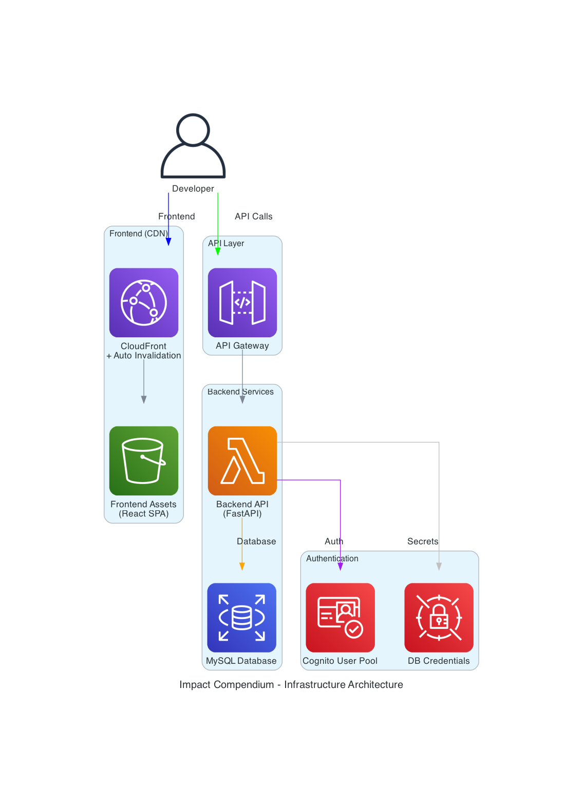

# Impact Compendium - Deployment Quick Reference

## 🏗️ Architecture Overview



**Key Components:**
- **CloudFront + S3**: Frontend distribution with automatic cache invalidation
- **API Gateway + Lambda**: Serverless backend API with FastAPI
- **RDS MySQL**: Database in private VPC subnets
- **Cognito**: User authentication and management
- **Secrets Manager**: Secure credential storage

## 🚀 Essential Commands

### Check Status (Enhanced)
```bash
cd Infrastructure/
./scripts/check-status.sh testing
```

### Deploy Everything (Safe to run multiple times)
```bash
./scripts/deploy-complete.sh testing
```

### Update Frontend Configuration (Automated)
```bash
./scripts/update-frontend-config.sh testing
```

### Update Frontend Only (Enhanced)
```bash
./scripts/deploy-frontend.sh testing
```
**Features**: Auto-build, S3 sync with cleanup, CloudFront invalidation

### Smart Cleanup
```bash
./scripts/delete-complete.sh testing
```

### Emergency Force Delete
```bash
./scripts/force-delete.sh testing all          # Everything
./scripts/force-delete.sh testing backend     # Backend only
./scripts/force-delete.sh testing infrastructure  # Infrastructure only
```

## 📋 Enhanced Deployment Flow

```
1. check-status.sh           → Detailed status + error analysis
2. deploy-complete.sh        → Smart deployment (auto-config sync + invalidation)
3. update-frontend-config.sh → Sync frontend config with backend URLs
4. deploy-frontend.sh        → Frontend updates (auto-build + invalidation)
5. delete-complete.sh        → Safe cleanup with validation
6. force-delete.sh           → Emergency cleanup for stuck deployments
```

## 🚀 Key Enhancements

### Automatic Configuration Management
- ✅ **API URL Sync**: Frontend automatically gets current backend URL
- ✅ **Multi-file Update**: Updates `.env`, `.env.production`, `.env.local`
- ✅ **Cognito Sync**: Automatically syncs User Pool and Client IDs
- ✅ **Prevents Drift**: No manual configuration updates needed

### CloudFront Integration
- ✅ **Automatic Invalidation**: Cache cleared on every frontend deployment
- ✅ **Complete Coverage**: Invalidates all paths (`/*`)
- ✅ **Immediate Updates**: Changes visible without cache wait
- ✅ **Error Resilience**: Deployment succeeds even if invalidation fails

### Smart Deployment Features
- ✅ **Auto-build Detection**: Builds frontend if needed
- ✅ **Clean S3 Sync**: Removes old files with `--delete` flag
- ✅ **Status Monitoring**: Enhanced error detection and reporting
- ✅ **Idempotent Operations**: Safe to run multiple times

## 🏗️ Architecture

### Two-Stack System
- **Infrastructure**: `impact-compendium-infra-testing`
  - VPC, RDS, Cognito, S3, CloudFront
- **Backend**: `impact-compendium-backend-testing`
  - Lambda, API Gateway

### Smart Deployment
- ✅ **Checks existing resources** before creating
- ✅ **Updates instead of duplicating**
- ✅ **Uses CloudFormation exports** (no hardcoded IDs)
- ✅ **Idempotent operations** (safe to re-run)

## 🔗 Key URLs After Deployment

```bash
# API Endpoint
https://{api-id}.execute-api.us-east-1.amazonaws.com/testing/

# API Documentation  
https://{api-id}.execute-api.us-east-1.amazonaws.com/testing/docs

# Frontend Application
https://{cloudfront-id}.cloudfront.net
```

## 🔄 API URL Changes (Automated)

### When Backend URL Changes
```bash
# 1. Update all frontend environment files automatically
./scripts/update-frontend-config.sh testing

# 2. Rebuild and deploy with CloudFront invalidation
cd ../Frontend && npm run build
cd ../Infrastructure && ./scripts/deploy-frontend.sh testing
```

### Fully Automated (Recommended)
```bash
# This handles everything automatically:
# - Updates frontend config with current backend URL
# - Rebuilds frontend with new config
# - Deploys to S3 with cleanup
# - Invalidates CloudFront cache
./scripts/deploy-complete.sh testing
```

### Configuration Sync Features
- ✅ **Multi-file Update**: Updates `.env`, `.env.production`, `.env.local`
- ✅ **API URL Detection**: Gets current URL from CloudFormation stack
- ✅ **Cognito Sync**: Updates User Pool and Client IDs automatically
- ✅ **Build Integration**: Ensures frontend builds with correct config

## 🛠️ Error Handling

### Deployment Failures
```bash
# 1. Check what failed
./scripts/check-status.sh testing

# 2. Clean slate approach
./scripts/delete-complete.sh testing
./scripts/deploy-complete.sh testing

# 3. Emergency force delete (if stuck)
./scripts/force-delete.sh testing all
```

### Stack Status Issues
```bash
# Stuck in progress states
./scripts/force-delete.sh testing all

# Failed deployments
./scripts/delete-complete.sh testing
./scripts/deploy-complete.sh testing

# Partial failures
./scripts/force-delete.sh testing backend
./scripts/deploy-complete.sh testing
```

### Production Safety
```bash
# Extra confirmation required
./scripts/delete-complete.sh production
# Prompts: "Type 'DELETE PRODUCTION' to confirm"

./scripts/force-delete.sh production all
# Prompts: "Type 'FORCE DELETE' to confirm"
```

## 📁 File Structure

```
Infrastructure/
├── cloudformation-infrastructure-only.yaml  # Infrastructure template
├── backend-sam/template.yaml               # Backend SAM template
├── scripts/
│   ├── deploy-complete.sh                  # 🚀 Main deployment (auto-updates frontend config)
│   ├── check-status.sh                     # 📊 Enhanced status checker
│   ├── deploy-frontend.sh                  # 🌐 Frontend updater
│   ├── update-frontend-config.sh           # 🔧 Frontend config automation
│   ├── delete-complete.sh                  # 🗑️ Smart cleanup
│   └── force-delete.sh                     # 🚨 Emergency cleanup
└── DEPLOYMENT_GUIDE.md                     # 📖 Full documentation
```

## ⚡ Development Workflow

### First Time Setup
```bash
./scripts/deploy-complete.sh testing
```

### Daily Development
```bash
# Frontend changes
./scripts/deploy-frontend.sh testing

# Backend changes  
cd backend-sam/
sam build --profile IBD-DEV
sam deploy --config-env testing --profile IBD-DEV

# Check everything
../scripts/check-status.sh testing
```

### End of Day
```bash
# Optional: Clean up to save costs
./scripts/delete-complete.sh testing
```

## 💰 Cost Management

### Testing Environment: ~$35/month
- RDS db.t3.micro: ~$15/month
- Lambda: ~$5/month  
- S3 + CloudFront: ~$10/month
- Other services: ~$5/month

### Cost Optimization
- **Auto-stop RDS**: After 2 hours inactivity
- **Delete when not needed**: Use cleanup script
- **Monitor usage**: Check AWS Cost Explorer

## 🔒 Security Notes

### Required AWS Profile
- **Always use**: `--profile IBD-DEV`
- **Region**: `us-east-1`
- **Verify**: `aws sts get-caller-identity --profile IBD-DEV`

### Resource Naming
- **Base**: `impact-compendium`
- **Environment suffix**: `-testing` or `-prod`
- **Account ID suffix**: For S3 buckets only

## 📞 Support

### Common Solutions
1. **"Stack already exists"** → Use `check-status.sh` first
2. **"Import not found"** → Redeploy infrastructure stack
3. **"Build failed"** → Check Python dependencies in Backend/
4. **"Frontend 404"** → Run `deploy-frontend.sh` again

### Emergency Reset
```bash
# Nuclear option: Delete everything and start fresh
./scripts/force-delete.sh testing all
# Wait 5 minutes for complete deletion
./scripts/deploy-complete.sh testing
```

### Manual Resource Cleanup
```bash
# If automated cleanup fails
aws s3 rm s3://impact-compendium-frontend-testing-* --recursive --profile IBD-DEV
aws lambda delete-function --function-name impact-compendium-backend-api-testing --profile IBD-DEV
aws rds delete-db-instance --db-instance-identifier impact-compendium-db-testing --skip-final-snapshot --profile IBD-DEV
```
