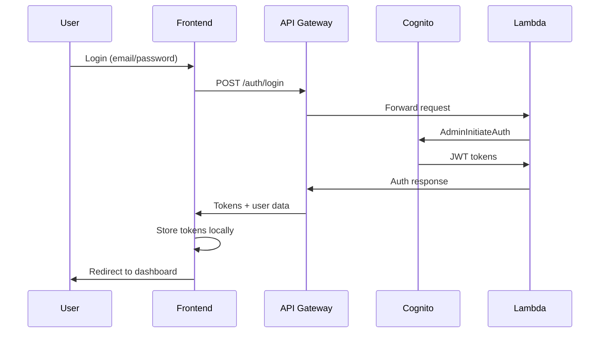

# Authentication Architecture

## Overview

This document describes the authentication and authorization architecture for the Impact Compendium application, implementing AWS Cognito for secure user management with role-based access control.

## Architecture Components

### 1. AWS Cognito User Pool

**Configuration**:
- **User Pool Name**: `impact-compendium-{environment}-users`
- **Authentication**: Email-based with password policy
- **Verification**: Email auto-verification enabled
- **Token Validity**: 8 hours (access/ID), 30 days (refresh)

**User Attributes**:
```yaml
Required:
  - email (primary identifier)
  - name (display name)

Optional:
  - organization (CGIAR center/partner)
  - role (custom attribute)
```

**Password Policy**:
- Minimum 8 characters
- Requires uppercase, lowercase, numbers
- No special characters required (CGIAR compatibility)

### 2. User Groups & Roles

#### Admin Group
- **Precedence**: 1 (highest)
- **Permissions**: Full system access
- **Capabilities**:
  - User management
  - System configuration
  - All CRUD operations
  - Analytics and reporting

#### Researcher Group  
- **Precedence**: 2
- **Permissions**: Study management
- **Capabilities**:
  - Create/edit own studies
  - View all published studies
  - Generate reports
  - Manage indicators

#### Viewer Group
- **Precedence**: 3 (lowest)
- **Permissions**: Read-only access
- **Capabilities**:
  - View published studies
  - Access public reports
  - Search and filter data

### 3. Authentication Flow



### 4. Token Management

#### JWT Token Structure
```json
{
  "sub": "user-uuid",
  "email": "user@cgiar.org",
  "name": "User Name",
  "cognito:groups": ["Researcher"],
  "custom:organization": "CIAT",
  "iss": "https://cognito-idp.region.amazonaws.com/pool-id",
  "exp": 1640995200
}
```

#### Token Storage (Frontend)
- **Access Token**: Memory + localStorage (8 hours)
- **ID Token**: Memory + localStorage (8 hours)  
- **Refresh Token**: localStorage only (30 days)
- **Auto-refresh**: 5 minutes before expiry

### 5. API Security

#### Authentication Middleware
```python
# Backend: app/middleware/auth.py
class CognitoAuth:
    - verify_token(): Validates JWT signature
    - get_jwks(): Fetches public keys
    - decode_payload(): Extracts user claims
```

#### Route Protection
```python
# Role-based decorators
@require_admin        # Admin only
@require_researcher   # Researcher + Admin
@get_current_user     # Any authenticated user
@get_current_user_optional  # Public with optional auth
```

#### API Gateway Integration
```yaml
# SAM Template
Auth:
  Authorizers:
    CognitoAuthorizer:
      UserPoolArn: !GetAtt CognitoUserPool.Arn
      Identity:
        Header: Authorization
```

## Security Implementation

### 1. Frontend Security

#### Authentication Context
```typescript
interface AuthContextType {
  user: User | null;
  tokens: AuthTokens | null;
  isAuthenticated: boolean;
  login: (email, password) => Promise<void>;
  logout: () => Promise<void>;
  hasRole: (role: string) => boolean;
}
```

#### Protected Routes
```typescript
<ProtectedRoute requiredRole="Researcher">
  <StudyManagement />
</ProtectedRoute>

<ProtectedRoute requiredRole="Admin">
  <AdminPanel />
</ProtectedRoute>
```

#### HTTP Interceptors
- Automatic token attachment
- Token refresh on 401 responses
- Logout on refresh failure

### 2. Backend Security

#### Token Validation
```python
async def get_current_user(credentials: HTTPAuthorizationCredentials):
    token = credentials.credentials
    payload = cognito_auth.verify_token(token)
    return {
        "sub": payload.get("sub"),
        "email": payload.get("email"),
        "groups": payload.get("cognito:groups", [])
    }
```

#### Role-Based Access
```python
async def require_researcher(current_user = Depends(get_current_user)):
    user_groups = current_user.get("groups", [])
    if not any(role in user_groups for role in ["Admin", "Researcher"]):
        raise HTTPException(status_code=403, detail="Insufficient permissions")
    return current_user
```

### 3. Infrastructure Security

#### Cognito Configuration
- **MFA**: Optional (can be enabled per user)
- **Account Recovery**: Email-based
- **Brute Force Protection**: Built-in AWS protection
- **HTTPS Only**: All communications encrypted

#### API Gateway Security
- **CORS**: Configured for frontend domains
- **Rate Limiting**: 100 requests/second per user
- **Request Validation**: Input sanitization
- **Logging**: All requests logged to CloudWatch

## User Management

### 1. User Registration

#### Self-Registration Flow
```typescript
// Frontend signup
const signup = async (userData: SignupRequest) => {
  const response = await fetch('/auth/signup', {
    method: 'POST',
    body: JSON.stringify(userData)
  });
  // User created with temporary password
  // Admin assigns to appropriate group
};
```

#### Admin-Managed Registration
```python
# Backend admin endpoint
@router.post("/admin/users")
async def create_user(
    user_data: UserCreate,
    current_user = Depends(require_admin)
):
    # Create user in Cognito
    # Assign to group based on role
    # Send welcome email
```

### 2. Group Management

#### Automatic Assignment
- New users → Viewer group (default)
- CGIAR email domains → Researcher group
- Manual promotion → Admin group

#### Group Operations
```python
# Add user to group
client.admin_add_user_to_group(
    UserPoolId=user_pool_id,
    Username=username,
    GroupName=group_name
)

# Remove from group
client.admin_remove_user_from_group(
    UserPoolId=user_pool_id,
    Username=username,
    GroupName=group_name
)
```

## API Endpoints

### Authentication Endpoints

```yaml
POST /auth/login:
  description: User authentication
  body: { email, password }
  response: { access_token, id_token, refresh_token }

POST /auth/signup:
  description: User registration
  body: { email, password, name, organization }
  response: { message, username }

GET /auth/me:
  description: Get user profile
  headers: { Authorization: Bearer <token> }
  response: { sub, email, name, groups }

POST /auth/refresh:
  description: Refresh access token
  body: { refresh_token }
  response: { access_token, id_token }

POST /auth/logout:
  description: Invalidate user tokens
  headers: { Authorization: Bearer <token> }
  response: { message }
```

### Protected Endpoints

```yaml
GET /studies:
  auth: Optional
  description: List studies (public + private based on auth)

POST /studies:
  auth: Required (Researcher+)
  description: Create new study

PUT /studies/{id}:
  auth: Required (Owner or Admin)
  description: Update study

DELETE /studies/{id}:
  auth: Required (Owner or Admin)
  description: Delete study

GET /admin/*:
  auth: Required (Admin only)
  description: Administrative functions
```

## Error Handling

### Authentication Errors

```typescript
// Frontend error handling
try {
  await login(email, password);
} catch (error) {
  switch (error.status) {
    case 401:
      setError("Invalid email or password");
      break;
    case 400:
      setError("Please verify your email address");
      break;
    case 500:
      setError("Authentication service unavailable");
      break;
  }
}
```

### Backend Error Responses

```python
# Standardized error format
{
  "error": "Invalid token",
  "status_code": 401,
  "path": "/studies",
  "timestamp": "2024-10-21T18:00:00Z"
}
```

## Monitoring & Logging

### CloudWatch Metrics
- Authentication attempts (success/failure)
- Token refresh rates
- API endpoint usage by role
- Error rates by endpoint

### Security Events
- Failed login attempts
- Token validation failures
- Unauthorized access attempts
- Role escalation attempts

### Audit Trail
```json
{
  "timestamp": "2024-10-21T18:00:00Z",
  "user": "user@cgiar.org",
  "action": "study.create",
  "resource": "study-123",
  "ip_address": "192.168.1.1",
  "user_agent": "Mozilla/5.0...",
  "result": "success"
}
```

## Deployment Configuration

### Environment Variables

```bash
# Backend Lambda
COGNITO_USER_POOL_ID=us-east-1_xxxxxxxxx
COGNITO_CLIENT_ID=xxxxxxxxxxxxxxxxxxxxxxxxxx
COGNITO_REGION=us-east-1

# Frontend React
REACT_APP_API_URL=https://api.impact-compendium.cgiar.org
REACT_APP_COGNITO_REGION=us-east-1
REACT_APP_COGNITO_USER_POOL_ID=us-east-1_xxxxxxxxx
REACT_APP_COGNITO_CLIENT_ID=xxxxxxxxxxxxxxxxxxxxxxxxxx
```

### SAM Template Resources

```yaml
CognitoUserPool:
  Type: AWS::Cognito::UserPool
  Properties:
    UserPoolName: !Sub "${ProjectName}-${Environment}-users"
    # ... configuration

CognitoUserPoolClient:
  Type: AWS::Cognito::UserPoolClient
  Properties:
    UserPoolId: !Ref CognitoUserPool
    # ... configuration

AdminGroup:
  Type: AWS::Cognito::UserPoolGroup
  Properties:
    GroupName: Admin
    Precedence: 1

ResearcherGroup:
  Type: AWS::Cognito::UserPoolGroup
  Properties:
    GroupName: Researcher
    Precedence: 2
```

## Testing Strategy

### Unit Tests
```python
# Backend authentication tests
def test_token_validation():
    valid_token = generate_test_token()
    user = cognito_auth.verify_token(valid_token)
    assert user['email'] == 'test@cgiar.org'

def test_role_authorization():
    researcher_user = {'groups': ['Researcher']}
    assert require_researcher(researcher_user) is not None
```

### Integration Tests
```typescript
// Frontend authentication flow
describe('Authentication Flow', () => {
  it('should login successfully with valid credentials', async () => {
    const { login } = renderAuthProvider();
    await login('test@cgiar.org', 'password');
    expect(localStorage.getItem('auth_tokens')).toBeTruthy();
  });
});
```

### End-to-End Tests
- Complete login/logout flow
- Role-based access control
- Token refresh mechanism
- Protected route navigation

## Security Best Practices

### 1. Token Security
- Short-lived access tokens (8 hours)
- Secure storage (httpOnly cookies in production)
- Automatic token rotation
- Logout on suspicious activity

### 2. Input Validation
- Email format validation
- Password strength requirements
- SQL injection prevention
- XSS protection

### 3. Network Security
- HTTPS enforcement
- CORS configuration
- Rate limiting
- Request size limits

### 4. Monitoring
- Failed authentication alerts
- Unusual access patterns
- Token abuse detection
- Regular security audits

## Future Enhancements

### 1. Multi-Factor Authentication
- SMS/Email OTP
- TOTP authenticator apps
- Hardware security keys

### 2. Social Login
- Google Workspace integration
- Microsoft Azure AD
- ORCID authentication

### 3. Advanced Security
- Device fingerprinting
- Geolocation-based access
- Behavioral analytics
- Zero-trust architecture

---

**Document Version**: 1.0  
**Last Updated**: October 21, 2025  
**Author**: Amazon Q - Sprint 5 Implementation
